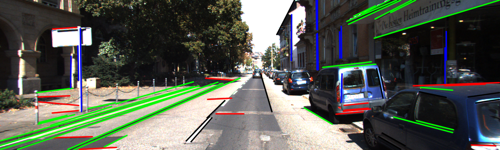

# VP_detection_ros
a simple ROS code to detect the vanishing point of an image based on Vanishing Point algorithm by Xiaohu Lu et al. - http://xiaohulugo.github.io/papers/Vanishing_Point_Detection_WACV2017.pdf

* camera parameters are loaded using camera info msg
    * I used (fx+fy)/2 for the focal length
* only the VP within the image is visulized
* the VP is visualized as a red dot
* current topics are set to use kitti dataset
    * image topic: /kitti/camera_color_left/image_raw
    * camera info topic: /kitti/camera_color_left/camera_info

### input:
* image
* camera info

### output:
* image with VP visualized

### potential improvements:
* crop the image to the region of interest (ROI) to reduce noise

### REF:
https://github.com/rayryeng/XiaohuLuVPDetection
